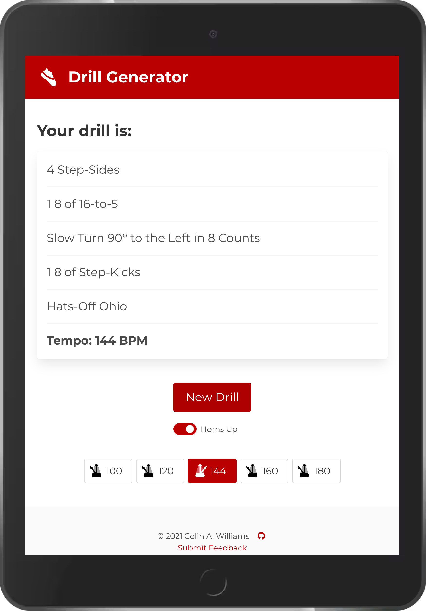

# Drill Generator

[Drill Generator](https://drillgenerator.com) generates drill in the style of
OSUMB summer sessions and tryouts to help candidates practice and to help squad
leaders come up with drill.

## Usage

Tap "New Drill" to generate a drill.

Toggle "Horns Up" or "Horns Down" drill with the switch.

Tap the metronome buttons to keep time.

## Credits

Logo:
[shoes by nico bayu saputro from the Noun Project](https://thenounproject.com/term/shoes/2592925)

`metronome.js` adapted from code by
[Grant James](https://github.com/grantjames/metronome)

`unmute.js` by [Spencer Evans](https://github.com/swevans/unmute)

[Bulma frontend framework by Jeremy Thomas](https://github.com/jgthms/bulma)

[Bulma Switch component by Wikiki](https://github.com/Wikiki/bulma-switch)

## License

[MIT](LICENSE) © Colin A. Williams
